# Agent Creation System - Flow Diagram

## Complete Agent Creation Flow

```mermaid
flowchart TB
    Start(["User Request"]) --> Main["main.py: create_agent"]
    Main --> Genesis["genesis.py: genesis function"]
    Genesis --> Validate{"Input Validation"}
    Validate -- Invalid --> Error1["Raise ValidationError"]
    Validate -- Valid --> MDP["mdp_converter.py:<br>convert_query_via_mdp"]
    MDP --> Structured["Structured Instruction<br>with capabilities"]
    Structured --> Setup["agent_setup.py:<br>create_agent_setup"]
    Setup --> Config["Agent Configuration<br>with UUID &amp; system prompt"]
    Config --> Selector["llm_selector.py:<br>select_and_instantiate_llm"]
    Selector --> LLM2["LLM analyzes requirements"]
    LLM2 --> ModelSelect["ModelSelection object<br>with chosen model"]
    ModelSelect --> AddModel["Add selected_model<br>to agent_config"]
    AddModel --> QA["qa_vet.py:<br>quality_assurance_test"]
    QA --> GenQ["generate_challenge_questions"]
    GenQ --> LLM3["LLM generates<br>varied difficulty questions"]
    LLM3 --> Questions["5 questions with<br>difficulty 0.2-0.9"]
    Questions --> Loop{"For each question"}
    Loop --> SimAgent["simulate_agent_response"]
    SimAgent --> LLM4["Agent LLM responds<br>using system prompt"]
    LLM4 --> Response["Agent response"]
    Response --> Loop
    Loop -- All answered --> Eval["evaluate_responses"]
    Eval --> LLM5["LLM evaluates<br>semantic similarity"]
    LLM5 --> Scores["Scores with<br>correct/score/difficulty"]
    Scores --> CalcVar["calculate_variance"]
    CalcVar --> Variance["Variance = p×1-p"]
    Variance --> Check{"QA Passed?"}
    Check -- "avg &gt;= 0.6 AND<br>0.15 &lt;= variance &lt;= 0.35" --> Success["QA PASSED"]
    Check -- Failed --> Retry{"Retry count<br>&lt; 3?"}
    Retry -- Yes --> RetryFunc["retry.py: genesis_retry"]
    RetryFunc --> Strategy["Determine adjustment<br>strategy based on attempt"]
    Strategy -- Attempt 1 --> Strat1["Adjust prompt<br>for difficulty"]
    Strategy -- Attempt 2 --> Strat2["Modify capabilities<br>&amp; constraints"]
    Strategy -- Attempt 3 --> Strat3["Simplify or<br>increase complexity"]
    Strat1 --> Apply["Apply adjustments<br>to agent_config"]
    Strat2 --> Apply
    Strat3 --> Apply
    Apply --> QA
    Retry -- No, exhausted --> Fail["Return failure:<br>Human intervention required"]
    Success --> Generate["agent_generator.py:<br>create_agent_a2a"]
    Generate --> CreateDir["Create output directory:<br>base_path/agent_name/"]
    CreateDir --> GenCode["Generate Python code<br>with A2A interface"]
    GenCode --> WriteFile["Write agent file"]
    WriteFile --> Return["Return success with<br>agent_id, endpoint, scores"]
    Return --> End(["Agent Created"])

    style Start fill:#e1f5ff
    style Genesis fill:#fff4e1
    style QA fill:#ffe1f5
    style Success fill:#e1ffe1
    style Fail fill:#ffe1e1
    style Generate fill:#e1ffe1
    style End fill:#e1f5ff
```



## Key Components

### 1. Entry Point (main.py)
- Accepts user instruction
- Calls `genesis()` function
- Handles errors and prints results

### 2. Genesis Orchestrator (genesis.py)
- **Input Validation**: Checks instruction length (10-5000 chars)
- **MDP Conversion**: Converts natural language to structured config
- **Agent Setup**: Creates agent configuration with UUID
- **LLM Selection**: Chooses optimal model for the task
- **QA Testing**: Runs SPICE-based quality assurance
- **Retry Logic**: Up to 3 attempts with intelligent adjustments
- **Agent Generation**: Creates final A2A-compatible agent file

### 3. QA System (qa_vet.py) - SPICE Framework
- **Question Generation**: LLM creates varied difficulty questions (0.2-0.9)
- **Agent Testing**: Selected model answers each question
- **Evaluation**: LLM evaluates semantic similarity
- **Variance Calculation**: p(1-p) where p = pass rate
- **Target**: Variance ~0.25 (50% pass rate)

### 4. Retry Mechanism (retry.py)
- **Attempt 1**: Enhance system prompt for edge cases
- **Attempt 2**: Modify capabilities and add constraints
- **Attempt 3**: Simplify or increase complexity
- **After 3 attempts**: Request human intervention

### 5. Agent Generation (agent_generator.py)
- Creates Python class with A2A interface
- Includes `process()`, `send_message()`, `receive_message()`, `broadcast()`
- Uses selected model from configuration
- Outputs to: `agents/generated/{agent_type}/{agent_name}_{id}.py`

## Success Criteria

**QA Must Pass:**
- Average score >= 0.6 (demonstrates competence)
- Variance in range [0.15, 0.35] (questions at capability frontier)

**If QA Fails:**
- System retries up to 3 times with different strategies
- Each retry adjusts agent configuration intelligently
- After 3 failures, returns error requesting human review

## Usage

```bash
# Run from project root
python -m src.agent_creator.main "Create an agent that checks today's news"
```

## Output Structure

```
agents/generated/
└── news_checker/
    └── news_checker_abc12345.py  # Full A2A-compatible agent
```
