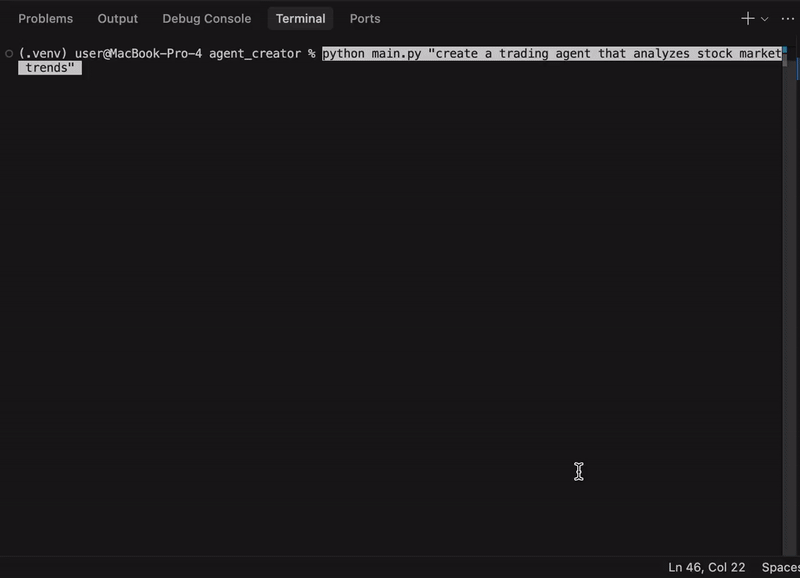
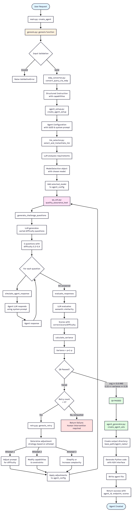

# Genesis: Self-Expanding Multi-Agent System


## Overview

This project contains the core for a self-expanding multi-agent system built to overcome one of the biggest limitation in today's AI ecosystems: static agents that can't evolve. Instead of relying on a fixed set of tools, it listens to a natural-language request, understands the need, and creates the exact agent required in real time.


Using Google's ADK and a five-stage orchestration pipeline, it transforms vague instructions into structured intent, selects the best model for the job, stress-tests the new agent through SPICE self-play, and finally generates an agent file that can join the multi-agent network as a fully operational, A2A-compliant tool.

**In simple words**: this system gives AI the ability to reproduce new agents on demand, closing capability gaps, preventing hallucinations, and enabling real enterprise-grade autonomy.

## Problem
Currently in multi-agent system, sub-agent and tools are mostly static and fixed, relying on predefined agents and tools fixed at launch. The moment an agent encounters a task it wasn’t perfectly designed for, the system either halts, chooses a sub-optimal tool, or worst of all confidently lies (hallucinates) about an incorrect answer. This inability to adapt or self-repair leads to wasted token cost, missed business opportunities, and severely limits enterprise adoption.

## Solution
This a Level 4 autonomous “Agent-as-a-Tool” system that introduces true self-expansion. Instead of relying on a fixed toolkit, Genesis takes any natural-language styled request for a new system need, converts it into a structured query, and dynamically creates the exact agent required to fulfill the request. Using Markovian decision logic, Genesis detects capability gaps, generates a specialized agent on the fly, configures its resources and mission prompts, performs QA using SPICE approach and deploys it instantly into the multi-agent hive with A2A Support.
In simple terms: Genesis is the reproductive system of an AI—allowing a multi-agent environment to grow new agents as tools whenever the need arises.

## Architecture

Genesis operates through a **5-stage pipeline**:



1. **MDP Converter** - Transforms natural language into structured agent requirements using Markovian Decision Process
2. **Agent Setup** - Creates agent configuration blueprint with capabilities and constraints
3. **LLM Selector** - Uses model-of-models approach to select optimal LLM for the agent
4. **SPICE QA** - Stress-tests the agent through adversarial self-play evaluation
5. **Agent Generator** - Generates production-ready Python code with A2A compliance

See [ARCHITECTURE.md](ARCHITECTURE.md) for detailed technical documentation.

## Installation

```bash
# Clone the repository
git clone <repository-url>

# Install dependencies
pip install -r requirements.txt

# Set up environment variables
cp .env.example .env
# Edit .env and add your GOOGLE_API_KEY
```

## Usage

### Method 1: Command Line

```bash
cd /src/agent_creator
python main.py "create a trading agent that analyzes stock market trends"
```

### Method 2: Python Function

```python
result = create_agent("create a trading agent that analyzes stock market trends")
print(result)
```

### Output

Genesis will generate a new agent and return:

```json
{
  "success": true,
  "agent_id": "a1b2c3d4-e5f6-7890-abcd-ef1234567890",
  "agent_type": "trading_agent",
  "capabilities": ["market_analysis", "trend_detection", "risk_assessment"],
  "a2a_endpoint": "agents/generated/trading_agent/trading_agent_a1b2c3d4.py",
  "qa_scores": {
    "average": 0.75,
    "variance": 0.24
  }
}
```

The generated agent will be saved to `src/agent_creator/agents/generated/` and is ready to use.

## Generated Agent Usage

```python
# Import the generated agent
from agents.generated.trading_agent.trading_agent_a1b2c3d4 import create_agent

# Create instance
agent = create_agent()

# Use the agent
response = agent.process("What are the current market trends for tech stocks?")
print(response)
```

## Key Features

- **Dynamic Agent Creation** - Generate specialized agents on demand from natural language
- **Model Agnostic** - Works with Google Gemini, OpenAI, or any LLM provider
- **Quality Assurance** - SPICE-based testing ensures agent competence before deployment
- **A2A Compliance** - Generated agents are network-ready for multi-agent orchestration
- **Production Ready** - Generates complete Python classes with proper error handling

## Technology Stack

- **Google ADK** - AI Developer Kit for Gemini integration
- **Python 3.11.0** - Core implementation language
- **SPICE Framework** - Self-play evaluation methodology
- **A2A Protocol** - Agent-to-agent communication standard

## Project Structure

```
5days/
├── src/agent_creator/
│   ├── core/           # Genesis orchestration pipeline
│   ├── llm/            # LLM client abstraction
│   ├── qa/             # SPICE quality assurance
│   ├── agents/         # Generated agents directory
│   └── main.py         # Entry point
├── ARCHITECTURE.md     # Detailed technical documentation
└── README.md          # This file
```

## Future Enhancements

- **Local Model Support** - Download and finetune models from Hugging Face for local finetuning and deployment


## Contributing
Contributions are welcome!
